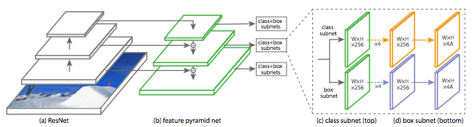

# RetinaNet (PyTorch)

PyTorch implementation of [Focal Loss for Dense Object Detection](https://arxiv.org/pdf/1708.02002.pdf).



## Train

This implementation features experiment-based training. You can setup your own experiment by creating a subdirectory of `exps`, and a `config.py` file containing all the training and evaluation parameters. You can then simply train by running:

```
python train.py --exp exp_subdirectory_name
```

## Pascal VOC

I have prepared an experiment on Pascal VOC 2012. Make sure you softlink the Pascal VOC 2012 directory (i.e. the one containing `Annotations`, `JPEGImages` and `ImageSets`) inside your data directory before training.

```
mkdir data
ln -s /path/to/voc/data data/VOC2012
python train.py --exp voc
```

The chekpoint of the best model will automatically be saved in the `ckpts` directory.

## Notes

This implementation was tested on a smaller VOC-like dataset, and seems to work properly.
First results on Pascal VOC don't look accurate enough.
Currently working on figuring out what the problem is, and on the evaluation code.

Some code was taken from both [c0nn3r's implementation](https://github.com/c0nn3r/RetinaNet) and [kuangliu's](https://github.com/kuangliu/pytorch-retinanet).
